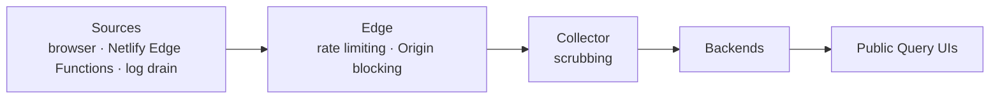

# OpenTelemetry Website Infra

This repository contains the observability pipeline for the OpenTelemetry
project's own websites, [opentelemetry.io][] and [explorer.opentelemetry.io][].
Telemetry flows from Sources through the Edge into the Collector, which scrubs
it and exports to Backends whose Query UIs are open to anyone.

## Architecture

The Collector is the only component exposed for writes: a public, secretless
Ingest endpoint that accepts OTLP/HTTP traces and metrics, so browser Sources
can send telemetry without embedding credentials in public pages. The Edge —
the Worker that Cloudflare Containers put in front of every container —
rate-limits requests, caps body size, and blocks unlisted Origins.

The pipeline's vocabulary is defined in [CONTEXT.md](CONTEXT.md).

## Privacy

The Query UIs are public, so anything the Collector exports is world-visible.
Scrubbing is therefore a default-deny allowlist: the Collector deletes every
attribute not explicitly allowlisted before export, rather than blocking known
sensitive fields. Client IP addresses, user agents, full URLs, query strings,
and referrers never survive Scrubbing.

The guarantee is enforced in the Collector — not trusted to Sources — and
proven by a CI regression test on every change.

## Community

This project is run under the umbrella of the OpenTelemetry Communications SIG.
The Communications SIG meets every two weeks on Tuesday at 9:00 AM PT. Check
out the [OpenTelemetry community calendar][] for the Zoom link and any updates
to this schedule.

Meeting notes are available as a public [Google doc][].

You can also reach out in the `#otel-comms` channel on [Slack][].

## Maintainers

- [Fabrizio Ferri-Benedetti](https://github.com/theletterf), Elastic
- [Jay DeLuca](https://github.com/jaydeluca), Grafana Labs
- [Marylia Gutierrez](https://github.com/maryliag), Grafana Labs
- [Patrice Chalin](https://github.com/chalin), CNCF
- [Phillip Carter](https://github.com/cartermp), Salesforce
- [Severin Neumann](https://github.com/svrnm), Bronto
- [Tiffany Hrabusa](https://github.com/tiffany76), Grafana Labs
- [Vitor Vasconcellos](https://github.com/vitorvasc), DoorDash

For more information about the maintainer role, see the
[community repository](https://github.com/open-telemetry/community/blob/main/guides/contributor/membership.md#maintainer).

[opentelemetry.io]: https://opentelemetry.io
[explorer.opentelemetry.io]: https://explorer.opentelemetry.io
[opentelemetry community calendar]:
  https://calendar.google.com/calendar/u/0/embed?src=c_2bf73e3b6b530da4babd444e72b76a6ad893a5c3f43cf40467abc7a9a897f977@group.calendar.google.com
[google doc]:
  https://docs.google.com/document/d/1wW0jLldwXN8Nptq2xmgETGbGn9eWP8fitvD5njM-xZY/edit?usp=sharing
[slack]: https://slack.cncf.io/
